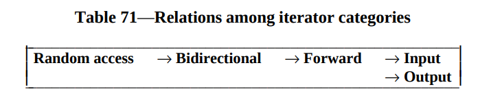
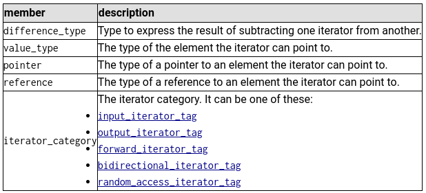

# 42_Containers
Prompt : recode c++ containers from scratch
(petit brol de liens, tutos et autre pour mes amis franglais)

## About the project

<wip>

### Definition of a container

> Containers are objects that store other objects. They control allocation and deallocation of these objects through constructors, destructors, insert and erase operations.
Source : [Norme ISO IEC 14882/1998](https://www.lirmm.fr/~ducour/Doc-objets/ISO+IEC+14882-1998.pdf)

They are two categories of containers :
1. **Sequences** (deque, list, queue, stack, vector)

	A sequence is a kind of container that organizes a finite set of objects, all of the same type, into a strictly linear arrangement.

	`vector` should be used by default.
	`list` should be used when there are frequent insertions and deletions from the middle of the sequence.
	`deque` should be used when most insertions and deletions take place at the beginning or at the end of the sequence.

	
	[Source](https://hackingcpp.com/cpp/std/sequence_containers.html)

2. **Associatives containers** (map, set, bitset)

	Associative containers provide an ability for fast retrieval of data based on keys.
	`map` associates an arbitrary type T with the Key. 
	An associative container supports unique keys if it may contain at most one element for each key. `map`and `set` support unique keys.

	For `set`, the value type is the same as the key type. 
	For `map`, it is equal to `pair<const Key, T>`.

	

### Performance and optimisation

Sources:
- [FreeCodeCamp - Big 0 Complexity Chart](https://www.freecodecamp.org/news/big-o-cheat-sheet-time-complexity-chart/)
- [Youtube Video on Classes of Complexity (FR)](https://www.youtube.com/watch?v=vzUK6YxkhB0)
- [HappyCoders - Big 0 Notation](https://www.happycoders.eu/algorithms/big-o-notation-time-complexity/)


The efficiency of algorithms is judged by the amount of resources they require, namely :
- time: duration of execution
- space: allocated hardware resources

Ainsi, le temps d'éxécution de l'algorithme constitue la ressource la plus significative qu'il faut quantifier : on parle alors de **complexité temporelle**. vous vous en doutez : moins la complexité est importante, plus l'algorithme est performant. Vu qu'un ordinateur plus puissant exécutera plus rapidement un programme, on va tenter de calculer la complexité d'une manière plus générale, en faisant une approximation du nombre d'opérations qui seront menées (coucou c'est la complexité asymptotique). 

Pour se faire, on utilise la notation Grand O. 

For instance, the ISO norm requires a complexity of :
1. 0(1) for the member function `size()` of the `stack` container.
2. O(n) for the member function `assign()` of the `vector`container.

<p align="middle" float="left">


</p>
But what do all of these O's mean ?? :frowning: :open_mouth:

| Syntax   |      Name      | Definition | En supposant qu'une opération élémentaire prend 10 ns (nano sec) |
|:--------:|:--------------:|------------|---------|
| O(1) |  Constant | When your calculation is not dependent on the input size | O(1) = 10ns |
| O(log(n)) |    Logarithmic   | When the input size is reduced by half, maybe when iterating, handling recursion, or whatsoever | O(log(n)) = 20ns |
| O(n) | Linear |    When you have a single loop within your algorithm | O(n) = 500ns |
| O(nlog(n)) |  Quasilinear | in divide and conquer algos,  the problem is divided into sub problems(divide) that are solved separately and whose solutions are then combined (conquer). (ex: Quicksort, mergesort) | O(nlog(n)) = 850ns |
| O(n^k) |  Polynomial | When you have nested loops within your algorithm | O(n^k) = 25 µs (micro secondes) |
| O(2^n) |  Exponential | When the growth rate doubles with each addition to the input | O(2^n) = 130 jours ! |
| O(n!) |  Factorial | When the growth rate multiplies by itself | O(n!) = 10⁴8 ans !!! |

Exemple pour comprendre comment tout ca se calcule :

```pascal
// En pseudo code:

Algo de saisie:
Variables
	nom: Chaîne de caractères
Début
	Ecrire('Veuillez saisir votre nom: ')
	Lire(nom)
Fin
```
Ici, Ecrire et Lire comptent pour une opération, car ce sont deux instructions pouvant être réunies. Il n'y a donc qu'une seule opération dans l'algo => 0(1) (complexité constante)


Continuons :
```pascal
// En pseudo code:

Algo de saisie:
Variables
	nom, prenom, email: Chaîne de caractères
Début
	Ecrire('Veuillez saisir votre nom: ')
	Lire(nom)
	Ecrire('Veuillez saisir votre prenom: ')
	Lire(prenom)
	Ecrire('Veuillez saisir votre email: ')
	Lire(email)
Fin
```
Là, on a 3 opérations (Ecrire/Lire pour 1)nom, 2)prénom, 3)email). La complexité de cet algo est de 0(3). Comme ce chiffre ne changera jamais, et est donc CONSTANT, on dit que la complexité est de 0(1) (cf. la constance de l'algo!)

Dernier exemple :
```c

/* algo de recherche*/ 

int[4] tab = {1, 2, 3, 4};
int	   elem = n;

// Accéder à un élément de ce tableau :
for (size_t i = 0; i < 4; i++)
{
	if (int[i] == elem)
	{
		printf("The element was found!");
		break;
	}
}
printf("The element was not found...");
```
Dans le meilleur des scenarios, si la valeur n fournie par le user est le 1er élément du tableau, il n'y aura qu'une opération à faire. Mais si cet élément n'existe pas, on aura parcouru toute la tab_size + 1 ! On voit donc bien ici que la complexité de cet algo n'est pas constante. On dit alors que la complexité est ici de O(n) (complexité linéaire). n représente alors l'ordre de grandeur du nb d'opérations à exécuter, qui est équivalent au nombre d'itérations dans la boucle.

Si on a un algo qui, par exemple, demande de rechercher un élément au hasard dans deux tableaux de taille variable, la grandeur de la complexité sera égale à O(2n). Mais comme les facteurs multiplicatifs sont ignorés (coucou le 2), la complexité en Grand O est de O(n)!

Et ainsi de suite ! Si on a, pour x raisons, une situation où il y a deux boucles imbriquées, le nombre d'itérations de la grande boucle sera multiplié par le nombre d'itérations de la petit boucle. La complexité sera donc de O(n²) (complexité quadratique) (oui, elle ne fait pas partie du tableau, c'est que pour le kiff)


### Roadmap

#### (1) Stack

> The std::stack class is a container adaptor that gives the programmer the functionality of a stack - specifically, a LIFO (last-in, first-out) data structure.
> The class template acts as a wrapper to the underlying container - only a specific set of functions is provided. The stack pushes and pops the element from the back of the underlying container, known as the top of the stack.

Page 507 of the ISO Norm (23.2.3.3 Template class stack)

RAS, comprendre que stack a un underlying container c, et que du coup, recoder les fonctions membres (type empty(), pop(), top(), etc.) revient à juste appeler ces fonctions sur le container c.

#### (2) Some additional iterators and functions

#### Quick definition of iterators
> "Iterators are a generalization of pointers that allow a C++ program to work with different data structures
(containers) in a uniform manner. This International Standard defines five categories of iterators, according to the operations
defined on them: input iterators, output iterators, forward iterators, bidirectional iterators and random
access iterators, as shown in table 71" [(Norme ISO IEC 14882/1998)](https://www.lirmm.fr/~ducour/Doc-objets/ISO+IEC+14882-1998.pdf)

<p align="middle">

</p>

=> In short, the iterators must satisfy all the requirements of the iterators quoted to their **right**.

```cpp
namespace ft {

	template<class Category, class T, class Distance = ptrdiff_t, class Pointer = T*, class Reference = T&> 
	struct iterator;
	
	struct input_iterator_tag {};
	struct output_iterator_tag {};
	struct forward_iterator_tag: public input_iterator_tag {};
	struct bidirectional_iterator_tag: public forward_iterator_tag {};
	struct random_access_iterator_tag: public bidirectional_iterator_tag {};
}
```

**For every iterator type, a corresponding specialization of iterator_traits class template shall be defined**, with at least the following member types defined:
<p align="middle">

</p>


#### a. Iterator traits 
(Page 542 of the ISO Norm (24.3.1 Template class stack))

TODO : point sur typedef et typename à faire

std::ptrdiff_t is the signed integer type of the result of subtracting two pointers. https://en.cppreference.com/w/cpp/types/ptrdiff_t

Resources :
- [Iterator traits page on cplusplus](https://cplusplus.com/reference/iterator/iterator_traits/)
- [Iterator traits page on cppreference](https://en.cppreference.com/w/cpp/iterator/iterator_traits)


#### b. Reverse iterator

> "std::reverse_iterator is an iterator adaptor that reverses the direction of a given iterator. In other words, when provided with a bidirectional iterator, std::reverse_iterator produces a new iterator that moves from the end to the beginning of the sequence defined by the underlying bidirectional iterator."

Resources :
- [polytechnique (EN)](https://www.enseignement.polytechnique.fr/informatique/INF478/docs/Cpp/en/cpp/iterator/reverse_iterator.html)
- [cplusplus (EN)](https://cplusplus.com/reference/iterator/reverse_iterator/reverse_iterator/)

=> Todo : dire que la doc (sur cpp preference surtout) est super bien documentée, y a pas de piege, faut juste suivre
Attention ne pas oublier que c'est reverse, donc quand on fait les overload d'operateur,ne pas oublier d'inverser! (+ au lieu de - par exple)

#### c. Other functions

##### SFINAE notion
> "Substitution Failure Is Not An Error"
=> mécanisme du compilateur pour ignorer certaines instanciations de fonction ou de classe qui ne compilent pas, sans pour autant émettre une erreur de compilation.

Ressources :
- [cpp preference](https://en.cppreference.com/w/cpp/language/sfinae)
- [Article de J.Poelen sur la notion + exemples pour mieux gérer (FR)](https://jonathanpoelen.github.io/2020/04/sfinae/)
- [Article d'une fac canadienne (FR)](https://h-deb.clg.qc.ca/Sujets/Divers--cplusplus/SFINAE.html)
- [Wiki EN parce que pourquoi pas](https://en.wikipedia.org/wiki/Substitution_failure_is_not_an_error)


Le principe de substitution, késako ? Par exemple, si une fonction dépend d'un paramètre template, le compilateur va substituer le template par le type de l'expression à la compilation.
```cpp
template<typename T>
void	test(T value);

test("baz"); // <= à la compilation, T sera remplacé par char const * et value par "baz"
```

Sur ce principe, on est d'accord que si on a deux fonctions `test` de proto différents, le compilateur choisira la "version" de `test` la plus adaptée...

Mais que se passe-t-il si le compilateur peut utiliser les deux fonctions test ?
```cpp
template<typename T>
void	test(T value);

void	test(char const *value);

test("baz");
```
Et bien dans le mille Emile, ca trigger une erreur (`error: call to 'test' is ambiguous`).

***Ok, mais pourquoi nous parle-t-elle de SFINAE la dame, c'est quoi le rapport?***
<p align="left">

</p>
J'y viens ! Ca tient en deux mots : std::enable_if et std::is_integral :innocent:

#### (3) Vector

#### (4) Map

#### (5) Set (Bonus)


## Tips and tricks

### Resources

[Stack class template (in legacy to avoid missing post-98 implementations)](https://legacy.cplusplus.com/reference/stack/stack/)

### Tips

### Frequent errors