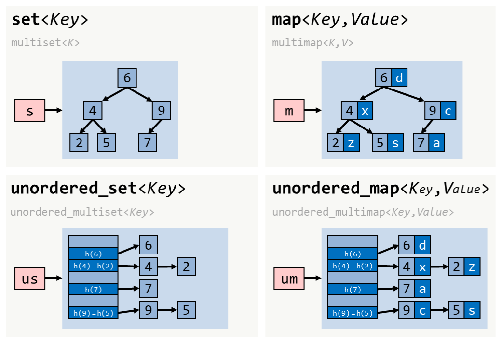

# 42_Containers
Prompt : recode c++ containers from scratch

## About the project

<wip>

### Definition of a container

> Containers are objects that store other objects. They control allocation and deallocation of these objects through constructors, destructors, insert and erase operations.
Source : [Norme ISO IEC 14882/1998](https://www.lirmm.fr/~ducour/Doc-objets/ISO+IEC+14882-1998.pdf)

They are two categories of containers :
1. **Sequences** (deque, list, queue, stack, vector)

	A sequence is a kind of container that organizes a finite set of objects, all of the same type, into a strictly linear arrangement.

	`vector` should be used by default.
	`list` should be used when there are frequent insertions and deletions from the middle of the sequence.
	`deque` should be used when most insertions and deletions take place at the beginning or at the end of the sequence.

	
	[Source](https://hackingcpp.com/cpp/std/sequence_containers.html)

2. **Associatives containers** (map, set, bitset)

	Associative containers provide an ability for fast retrieval of data based on keys.
	`map` associates an arbitrary type T with the Key. 
	An associative container supports unique keys if it may contain at most one element for each key. `map`and `set` support unique keys.

	For `set`, the value type is the same as the key type. 
	For `map`, it is equal to `pair<const Key, T>`.

	

### Roadmap

#### (1) Stack

> The std::stack class is a container adaptor that gives the programmer the functionality of a stack - specifically, a LIFO (last-in, first-out) data structure.
> The class template acts as a wrapper to the underlying container - only a specific set of functions is provided. The stack pushes and pops the element from the back of the underlying container, known as the top of the stack.

#### (2) Some additional iterators and functions

#### (3) Vector

#### (4) Map

#### (5) Set (Bonus)

## Tips and tricks

### Resources

[Stack class template (in legacy to avoid missing post-98 implementations)](https://legacy.cplusplus.com/reference/stack/stack/)

### Tips

### Frequent errors